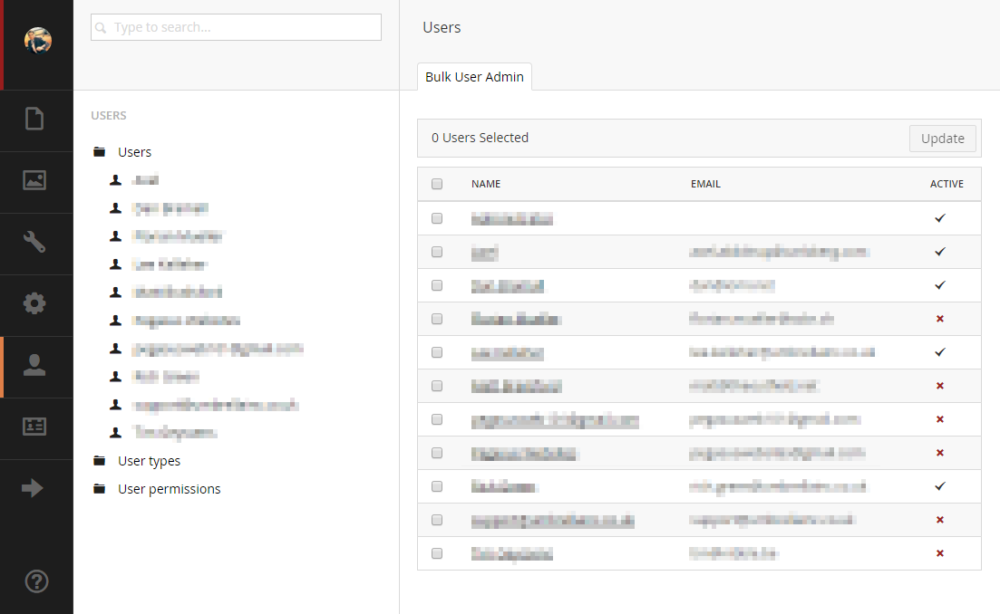

# Bulk User Admin for Umbraco

A dashboard for the Users section in the Umbraco back-office that enables bulk administration to edit users, e.g. change section permissions, disable access, etc.

## Features

Sorting of users by:

* Name
* Email
* User Type
* Active status

All columns are filterable. A partial match can be made against Name, Email or User Type. To filter Active status simply type "active" or "inactive".

> *Note:* The filter search term is invariant of case and culture.

---

## Getting Started

### Installation

> *Note:* Bulk User Admin for Umbraco has been developed against **Umbraco v7.2.0** and will support that version and above.

Bulk User Admin can be installed from either Our Umbraco or NuGet package repositories, or build manually from the source-code:

#### Our Umbraco package repository

To install from Our Umbraco, please download the package from:

> <https://our.umbraco.org/projects/backoffice-extensions/bulk-user-admin>

#### NuGet package repository

To [install from NuGet](https://www.nuget.org/packages/Our.Umbraco.BulkUserAdmin), you can run the following command from within Visual Studio:

	PM> Install-Package Our.Umbraco.BulkUserAdmin

We also have a [MyGet package repository](https://www.myget.org/gallery/umbraco-packages) - for bleeding-edge / development releases.

#### Manual build

If you prefer, you can compile the project yourself, you'll need:

* Visual Studio 2012 (or above)

To clone it locally click the "Clone in Windows" button above or run the following git commands.

	git clone https://github.com/leekelleher/umbraco-bulk-user-admin.git umbraco-bulk-user-admin
	cd umbraco-bulk-user-admin
	.\build.cmd

---

## Contributing to this project

Anyone and everyone is welcome to contribute. Please take a moment to review the [guidelines for contributing](CONTRIBUTING.md).

* [Bug reports](CONTRIBUTING.md#bugs)
* [Feature requests](CONTRIBUTING.md#features)
* [Pull requests](CONTRIBUTING.md#pull-requests)

## Contact

Have a question?

* [Raise an issue](https://github.com/leekelleher/umbraco-bulk-user-admin/issues) on GitHub

## Dev Team

* [Matt Brailsford](https://github.com/mattbrailsford)
* [Lee Kelleher](https://github.com/leekelleher)
* [Jamie Pollock](https://github.com/jamiepollock)

## License

Copyright &copy; 2015 Umbrella Inc, Our Umbraco and [other contributors](https://github.com/leekelleher/umbraco-bulk-user-admin/graphs/contributors)

Licensed under the [MIT License](LICENSE.md)
